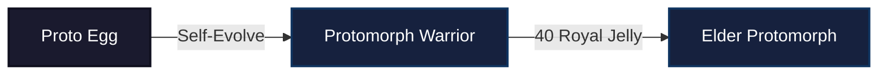

# Xenomorph Pathways

This guide shows all evolution pathways for xenomorphs, from the initial egg/facehugger stage through to their final forms.

## Main Pathways

### Human Pathway (Standard) { width="32" } { width="32" } { width="32" }

The classic xenomorph evolution path using human hosts.

| Stage | Requirements |
|-------|-------------|
| Facehugger → Drone | **Host:** human |
| Drone → Warrior | **Cost:** 10 Royal Jelly |
| Warrior → Praetorian | **Cost:** 25 Royal Jelly |
| Praetorian → Queen | **Cost:** 50 Royal Jelly |

---

### Runner Pathway (Dog/Beast) { width="32" } { width="32" }

A faster, more agile pathway using animal hosts.

| Stage | Requirements |
|-------|-------------|
| Facehugger → Runner | **Host:** dog, ox, bat, or snake |
| Runner → Sentry | **Cost:** 12 Royal Jelly |
| Sentry → Crusher | **Cost:** 30 Royal Jelly |
| Crusher → Queen | **Cost:** 60 Royal Jelly |

---

### King Pathway (Royal) { width="32" } { width="32" }

The most powerful pathway, creating royal xenomorphs.

| Stage | Requirements |
|-------|-------------|
| King Facehugger → Knight | **Cost:** 30 Royal Jelly **Host:** human, predator, or engineer |
| Knight → Grand Duke | **Cost:** 50 Royal Jelly |
| Grand Duke → Prince | **Cost:** 75 Royal Jelly |
| Prince → King | **Cost:** 120 Royal Jelly |

---

### Deacon Pathway (Engineer) { width="32" } { width="32" } { width="32" }

A unique pathway creating the powerful Deacon xenomorph.

| Stage | Requirements |
|-------|-------------|
| Hammerpede → Trilobite | **Cost:** 15 Royal Jelly |
| Trilobite → Deacon | **Cost:** 40 Royal Jelly **Host:** engineer |

---

### Neomorph Pathway { width="32" } { width="32" }

A separate evolution line starting from Neomorph eggs.

| Stage | Requirements |
|-------|-------------|
| Neomorph Egg → Bloodburster | Hatch the egg |
| Bloodburster → Neomorph | **Cost:** 35 Royal Jelly **Host:** human |

---

## Special Pathways

### Predalien Pathway { width="32" } { width="32" }

The hybrid xenomorph-predator evolution path, combining traits from both species.

| Stage | Requirements |
|-------|-------------|
| Predalien Egg → Predalien Facehugger | **Host:** predator (obtained through hunts) |
| Predalien Facehugger → Hybrid Chestburster | Automatic emergence |
| Hybrid Chestburster → Predalien Drone | **Cost:** 35 Royal Jelly |
| Predalien Drone → Predalien Warrior | **Cost:** 45 Royal Jelly |
| Predalien Warrior → Predalien Brute | **Cost:** 60 Royal Jelly |

---

### Spitter Pathway (Toxic) { width="32" } { width="32" }

Xenomorphs with potent acid-spitting abilities from toxic-exposed hosts.

| Stage | Requirements |
|-------|-------------|
| Classic Egg → Facehugger | **Host:** toxic-exposed human |
| Facehugger → Toxic Chestburster | Automatic emergence |
| Toxic Chestburster → Spitter Drone | **Cost:** 15 Royal Jelly |
| Spitter Drone → Spitter Warrior | **Cost:** 35 Royal Jelly |

---

### Prowler Pathway (Agile) { width="32" }

Highly agile xenomorphs from feline or avian hosts, specialized for stealth.

| Stage | Requirements |
|-------|-------------|
| Classic Egg → Facehugger | **Host:** feline or birdlike |
| Facehugger → Micro Chestburster | Automatic emergence |
| Micro Chestburster → Prowler Drone | **Cost:** 12 Royal Jelly |
| Prowler Drone → Prowling Assassin | **Cost:** 28 Royal Jelly |

---

### Protomorph Pathway (Self-Evolving) { width="32" }

Ancient xenomorph variant that evolves without a host - self-contained evolution.

| Stage | Requirements |
|-------|-------------|
| Proto Egg → Protomorph Warrior | **No host required** - self-evolves |
| Protomorph Warrior → Elder Protomorph | **Cost:** 40 Royal Jelly |

**Special Note:** This pathway is unique - the Proto Egg does not need a host and evolves independently.

---

### Jockey Pathway (Engineer) { width="32" } { width="32" }

Elite xenomorphs from the rare Space Jockey eggs and engineer hosts.

| Stage | Requirements |
|-------|-------------|
| Space Jockey Egg → Facehugger | **Host:** engineer (rare event capture) |
| Facehugger → Chestburster | Automatic emergence |
| Chestburster → Jockey Drone | **Cost:** 40 Royal Jelly |
| Jockey Drone → Jockey Sentinel | **Cost:** 65 Royal Jelly |

**Special Note:** Engineer hosts are extremely rare and obtained through special capture events.

---

### Irradiated Pathway { width="32" } { width="32" }

Radioactive xenomorphs from radiation-exposed hosts with unique glowing properties.

```mermaid
graph LR
    IE[Irradiated Egg] -->|Rad-Exposed Host| FH[Facehugger]
    FH -->|Emerge| GB[Glowing Burster]
    GB -->|20 Royal Jelly| ID[Irradiated Drone]
    ID -->|40 Royal Jelly| IW[Irradiated Warrior]
    
    classDef rad fill:#39FF14,stroke:#32CD32,stroke-width:2px,color:#000
    classDef glow fill:#00FF00,stroke:#39FF14,stroke-width:2px,color:#000
    classDef radioactive fill:#7FFF00,stroke:#00FF00,stroke-width:2px,color:#000
    
    class IE rad
    class FH,GB glow
    class ID,IW radioactive
```

| Stage | Requirements |
|-------|-------------|
| Irradiated Egg → Facehugger | **Host:** radiation-exposed human |
| Facehugger → Glowing Burster | Automatic emergence |
| Glowing Burster → Irradiated Drone | **Cost:** 20 Royal Jelly |
| Irradiated Drone → Irradiated Warrior | **Cost:** 40 Royal Jelly |

---

### Berserker Pathway { width="32" } { width="32" }

Powerful brute-force xenomorphs from large bear-like hosts.

| Stage | Requirements |
|-------|-------------|
| Berserker Egg → Facehugger | **Host:** bear-like (large creature) |
| Facehugger → Burster | Automatic emergence |
| Burster → Berserker Drone | **Cost:** 25 Royal Jelly |
| Berserker Drone → Berserker Warrior | **Cost:** 45 Royal Jelly |

---

## Host Types

Different hosts produce different xenomorph variants:

| Host Type | Produces | Used In |
|-----------|----------|---------|
| **Human** | Drone, Neomorph | Standard, King, Neomorph pathways |
| **Dog/Ox/Bat/Snake** | Runner | Runner pathway |
| **Predator** | Predalien | King pathway, Predalien pathway |
| **Engineer** | Deacon, Jockey | King, Deacon, Jockey pathways |
| **Toxic** | Spitter | Spitter pathway |
| **Feline/Bird** | Prowler | Prowler pathway |
| **Radiation-Exposed** | Irradiated | Irradiated pathway |
| **Bear-like (Large)** | Berserker | Berserker pathway |

---

## Tips

!!! tip "Resource Management"
    Royal Jelly is essential for evolution. Plan your evolution path carefully based on available resources.

!!! info "Host Rarity"
    Some hosts like Engineers and Predators are rare. Save special eggs until you have the appropriate host available.

!!! warning "Special Requirements"
    Some pathways have unique requirements - the Protomorph pathway doesn't need a host, while the Jockey pathway requires rare event captures.

!!! tip "More Information"
    For specific stat changes and abilities at each stage, see the [Encyclopedia command](Commands/Collection.md#encyclopedia).
